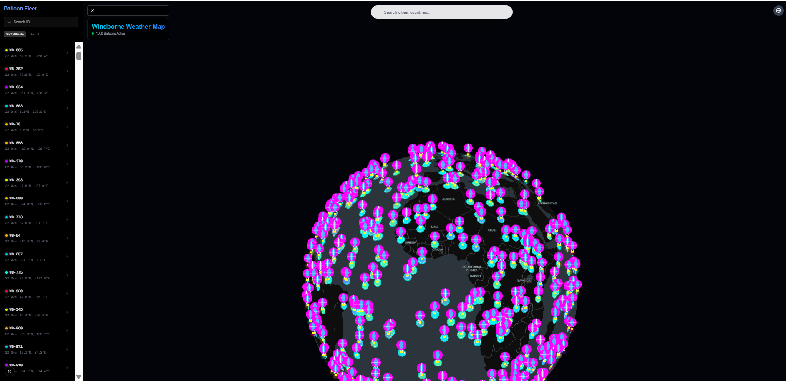
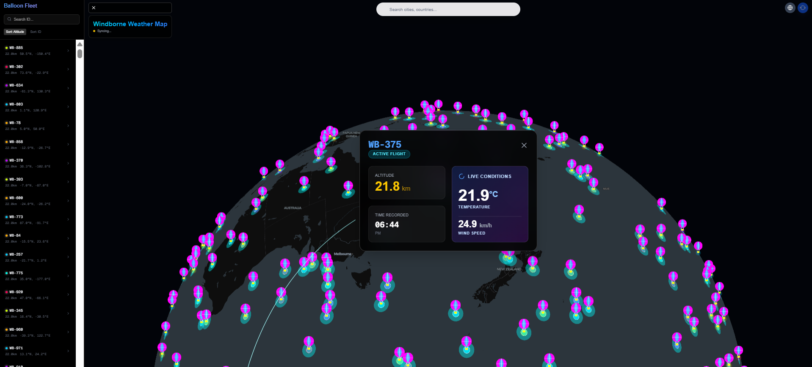

# Windborne Weather Map 🎈

Windborne is an interactive, 3D weather visualization platform that tracks hot air balloons globally. It features a dynamic globe view, real-time weather effects, and data-rich visualization of balloon flight paths.

## Features

-   **3D Globe Visualization**: Interactive "Earth in Circle" projection using MapLibre throughout the application.
-   **Real-time Weather Effects**: Dynamic overlays for wind, rain, and snow to visualize current conditions.
-   **Balloon Tracking**: Track hot air balloons with custom SVG icons and animated flight paths.
-   **Interactive Data**: Click on balloons to view detailed telemetry and flight information.
-   **Search & Navigation**: Easy location search to zoom to specific cities or countries.

## Tech Stack

-   **Framework**: [Next.js](https://nextjs.org/) (App Directory)
-   **UI Library**: [React](https://react.dev/)
-   **Styling**: [Tailwind CSS](https://tailwindcss.com/)
-   **Maps**: [MapLibre GL JS](https://maplibre.org/) & `react-map-gl`
-   **Icons**: [Lucide React](https://lucide.dev/)

## Getting Started

First, install the dependencies:

```bash
npm install
# or
yarn install
# or
pnpm install
```

Then, run the development server:

```bash
npm run dev
# or
yarn dev
# or
pnpm dev
```

.

Images 
Images 
## License

MIT
