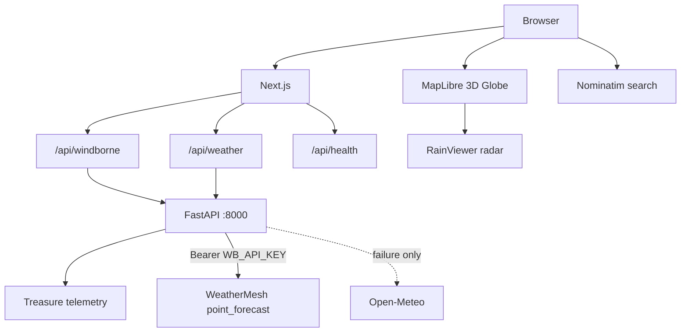

# Windborne

Interactive 3D globe for tracking WindBorne Systems stratospheric balloons, with live WeatherMesh forecasts and radar overlays.

**API check commands:** see [`API_CHECK.md`](./API_CHECK.md)

---

## What we have done so far

### 1. Core app (initial build)
- Next.js 16 + React 19 + Tailwind UI
- 3D globe via MapLibre / `react-map-gl` (rotate, zoom, tilt)
- Balloon markers, pulsing dots, click-to-select
- Animated flight path (~2.5s draw)
- Sidebar balloon list, refresh, auto-rotate
- Nominatim location search
- FastAPI backend that pulls 24h Treasure telemetry (`00.json`–`23.json`)

### 2. Google Earth–style globe + weather layers
- Default **satellite Earth** basemap (Esri, no key required)
- Basemap switcher: Earth / Hybrid / Dark / Streets
- Atmosphere (`setSky`) and Earth-like fly-to on balloon select
- **Live radar** from RainViewer (no key, refreshes every 5 minutes)
- Optional Clouds / Temp / Wind tiles when `NEXT_PUBLIC_OPENWEATHER_KEY` is set
- Optional MapTiler satellite + 3D terrain when `NEXT_PUBLIC_MAPTILER_KEY` is set
- Layers panel (bottom-right)
- Redesigned cyan balloon icon (`public/balloon.svg`)

### 3. Official WindBorne WeatherMesh forecast (verified)
- Working endpoint:

```text
https://api.windbornesystems.com/forecasts/v1/mm/point_forecast?coordinates=<lat>,<lon>
```

- Bearer auth with backend-only `WB_API_KEY` (never sent to the browser)
- FastAPI `WindBorneClient` normalizes the real response:
  - `forecasts` is a **nested** list: `forecasts[0] = [hourly records...]`
  - picks the hourly record closest to current UTC
  - maps `temperature_2m`, `pressure_msl`, `precipitation`, `wind_speed_10m`
  - wind direction from `wind_u_10m` / `wind_v_10m`
  - humidity from temperature + dewpoint, or `null` (not invented)
- UI weather cards show **WindBorne WeatherMesh**, not Open-Meteo
- Open-Meteo is a **real fallback only** (401/403/429/5xx/timeout/network/invalid JSON)
- 5-minute cache is WindBorne-only so fallback data cannot masquerade as WeatherMesh
- Last local verification: HTTP 200, provider `WindBorne WeatherMesh`, fallback **NO**

### 4. Supporting UI / data
- Balloon detail panel + city weather panel
- Weather-driven particle overlay (rain/snow/wind from real metrics)
- CSV weather log (`weather_data_log.csv`) from `/api/weather`
- Health proxy: `/api/health` → FastAPI `/health`

---

## Data flow

```text
Website (localhost:3000)
   ↓
Next.js /api/weather  and  /api/windborne
   ↓
FastAPI (localhost:8000)
   ↓
WindBorne official API
   ├── Treasure telemetry  → balloon positions
   └── /forecasts/v1/mm/point_forecast → WeatherMesh
         200 → parse → website
         failure → log exact reason → Open-Meteo fallback
```

---

## Getting started

### Prerequisites
- Node.js 18+
- Python 3.8+
- A WindBorne API key in `backend/.env` (for weather)

### Backend

```powershell
cd backend
copy .env.example .env
# edit .env and set WB_API_KEY
pip install -r requirements.txt
python -m uvicorn main:app --reload --host 127.0.0.1 --port 8000
```

`backend/.env`:

```env
WB_API_KEY=your_windborne_api_key
WINDBORNE_BASE_URL=https://api.windbornesystems.com
```

Optional frontend keys (later) in `.env.local`:

```env
NEXT_PUBLIC_MAPTILER_KEY=
NEXT_PUBLIC_OPENWEATHER_KEY=
```

### Frontend

```powershell
npm install
npm run dev
```

Open [http://localhost:3000](http://localhost:3000)

---

## How to use

1. **Globe** — drag to rotate, scroll to zoom, right-drag to tilt
2. **Balloons** — click a marker to fly the camera, draw the path, and open telemetry + WeatherMesh
3. **Search** — city/country → camera flies there and loads city weather
4. **Layers** — Earth / Hybrid / Dark / Streets + Radar (and keyed weather layers)
5. **Rotate** — globe auto-rotate toggle in the top-right

---

## How to check the API

Full command list (PowerShell + curl): **[`API_CHECK.md`](./API_CHECK.md)**

Quick check after both servers are running:

```powershell
# FastAPI health
Invoke-RestMethod http://127.0.0.1:8000/health

# Official weather through our backend
Invoke-RestMethod "http://127.0.0.1:8000/api/weather?lat=38.84&lon=-77.30" | ConvertTo-Json -Depth 6

# Same path the website uses
Invoke-RestMethod "http://localhost:3000/api/weather?lat=38.84&lon=-77.30" | ConvertTo-Json -Depth 6
```

You want:

```text
provider: WindBorne WeatherMesh
```

not:

```text
provider: Open-Meteo (Fallback)
```

---

## Architecture

| Layer | Stack |
|---|---|
| Frontend | Next.js App Router, React, Tailwind |
| Globe | MapLibre GL + react-map-gl, globe projection |
| Backend | FastAPI + httpx |
| Balloon data | WindBorne Treasure `a.windbornesystems.com/treasure/{00-23}.json` |
| Weather | WindBorne WeatherMesh `forecasts/v1/mm/point_forecast` |
| Radar | RainViewer (no key) |
| Search | OpenStreetMap Nominatim |
| Fallback weather | Open-Meteo (only if WindBorne fails) |


```mermaid
graph TD
    Client[Browser] --> Next[Next.js]
    Client --> MapLibre[MapLibre 3D Globe]
    Next --> WBProxy["/api/windborne"]
    Next --> WxProxy["/api/weather"]
    Next --> Health["/api/health"]
    WBProxy --> FastAPI[FastAPI :8000]
    WxProxy --> FastAPI
    FastAPI --> Treasure[Treasure telemetry]
    FastAPI -->|Bearer WB_API_KEY| Mesh[WeatherMesh point_forecast]
    FastAPI -.->|failure only| OM[Open-Meteo]
    Client --> Nominatim[Nominatim search]
    MapLibre --> Radar[RainViewer radar]
```

Key files:

| File | Role |
|---|---|
| `backend/main.py` | FastAPI routes: `/health`, `/windborne`, `/api/weather` |
| `backend/services/windborne.py` | Official forecast client, normalize, cache, fallback |
| `src/app/api/weather/route.ts` | Next.js weather proxy |
| `src/app/api/windborne/route.ts` | Next.js balloon proxy |
| `src/components/Map.tsx` | Globe, balloons, layers |
| `src/components/LayerControls.tsx` | Basemap + weather toggles |
| `src/services/weather.ts` | Frontend weather client |
| `src/config/map.ts` | Basemap / tile / key config |

---

## Last verified WeatherMesh result

```text
Endpoint used: https://api.windbornesystems.com/forecasts/v1/mm/point_forecast?coordinates=38.84,-77.3
HTTP status: 200
Provider returned: WindBorne WeatherMesh
Forecast timestamp: 2026-08-13T21:00:00Z
Temperature: 32.2
Pressure: 1012.1
Wind speed: 2.0
Fallback used: NO
```

---

## Not done yet

- WebSockets for live balloon updates (currently polls ~60s)
- Historical playback scrubber
- Volumetric clouds / Three.js layers
- User accounts / favorites
- AWS / Bedrock / MCP / production deploy
