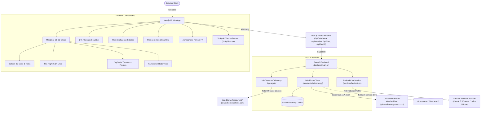

# 🎈 Windborne Operations 3D (WindBorne Fleet & WeatherMesh Tracker)

An interactive, mission-control 3D Earth globe for tracking **WindBorne Systems** stratospheric balloon constellations in real-time, featuring live **WindBorne WeatherMesh** atmospheric forecasts, **Vicky-AI** (Amazon Bedrock Co-Pilot), 24-hour historical telemetry scrubbing, dynamic day/night solar terminator, radar overlays, and flight data export.

[](https://fastapi.tiangolo.com)
[](https://nextjs.org)
[](https://maplibre.org)
[](https://windbornesystems.com)
[-FF9900?logo=amazon-aws&logoColor=white)](./AWS_BEDROCK_EC2_GUIDE.md)

---

## 📑 Table of Contents
- [✨ Key Features Built](#-key-features-built)
  - [1. 3D Globe & Earth Basemaps](#1-3d-globe--earth-basemaps)
  - [2. Fleet Telemetry & Balloon Tracking](#2-fleet-telemetry--balloon-tracking)
  - [3. 24-Hour Historical Playback Scrubber](#3-24-hour-historical-playback-scrubber)
  - [4. Solar Day/Night Terminator](#4-solar-daynight-terminator)
  - [5. WindBorne WeatherMesh Forecast Engine](#5-windborne-weathermesh-forecast-engine)
  - [6. Fleet Intelligence & Explorer Sidebar](#6-fleet-intelligence--explorer-sidebar)
  - [7. Mission Control Balloon Detail Panel](#7-mission-control-balloon-detail-panel)
  - [8. Global Geocoding & City Weather](#8-global-geocoding--city-weather)
  - [9. Atmospheric Weather Particle Engine](#9-atmospheric-weather-particle-engine)
  - [10. Live Radar & Weather Overlays](#10-live-radar--weather-overlays)
  - [11. Vicky-AI: Amazon Bedrock Mission Co-Pilot](#11-vicky-ai-amazon-bedrock-mission-co-pilot)
- [☁️ AWS EC2 & Amazon Bedrock Deployment Guide](#️-aws-ec2--amazon-bedrock-deployment-guide)
- [🏛️ Architecture & Data Flow](#️-architecture--data-flow)
- [📁 Project Structure & File Map](#-project-structure--file-map)
- [🚀 Getting Started](#-getting-started)
  - [Prerequisites](#prerequisites)
  - [Backend Setup (FastAPI)](#backend-setup-fastapi)
  - [Frontend Setup (Next.js)](#frontend-setup-nextjs)
- [🔍 API Endpoints & Verification](#-api-endpoints--verification)
- [📊 Telemetry & Weather Logging](#-telemetry--weather-logging)
- [🛠️ Configuration & Environment Variables](#️-configuration--environment-variables)

---

## ✨ Key Features Built

### 1. 3D Globe & Earth Basemaps
- **MapLibre GL 3D Globe Projection**: Full 3D sphere visualization with fluid drag-to-rotate, scroll-to-zoom, and pitch/tilt controls.
- **Multiple Basemap Styles**:
  - **Earth Satellite** (Esri World Imagery — default, no API key required)
  - **Hybrid Satellite** (Esri imagery with high-contrast road/boundary vectors)
  - **Dark Matter** (CartoDB Dark Matter for night-ops telemetry focus)
  - **Streets** (OpenStreetMap Carto)
  - **MapTiler 3D Satellite** (Optional, enabled with `NEXT_PUBLIC_MAPTILER_KEY`)
- **Atmospheric Sky Glow**: Integrated `setSky` atmospheric horizon shaders for a realistic orbital view.
- **Auto-Rotation & Reset**: Smooth auto-spin mode and single-click camera orientation reset (`Compass` control).

### 2. Fleet Telemetry & Balloon Tracking
- **24-Hour Constellation Ingestion**: Ingests WindBorne Treasure telemetry (`00.json` through `23.json`) from `https://a.windbornesystems.com/treasure/`.
- **Dynamic Flight Trajectories**: Animated 2.5-second path draw on balloon selection with distinct color-coding per balloon ID.
- **Custom Stratospheric Markers**: Cyan balloon SVG iconography with real-time pulsing beacon halos.
- **Live Camera Lock / Follow Mode**: Automatically tracks selected balloon during live movement or timeline scrubbing.

### 3. 24-Hour Historical Playback Scrubber
- **Interactive Time Scrubber (`TimelineControls.tsx`)**: Scrub anywhere across the past 24 hours of flight history.
- **Variable Playback Speeds**: Play/pause history at `0.5x`, `1x`, `2x`, or `4x` speeds.
- **Step Controls**: Step backward or forward in 1-hour increments.
- **Instant "LIVE" Indicator**: Jump back to live real-time positions with a single click.

### 4. Solar Day/Night Terminator
- **NOAA Solar Position Algorithm (`src/lib/sun.ts`)**: Accurately computes subsolar coordinates, ecliptic longitude, and solar declination.
- **Dynamic Night Shadow**: Renders a real-time GeoJSON shadow polygon cap across the globe.
- **Synchronized Scrubbing**: As you scrub historical time, the day/night terminator shifts accurately across the Earth's surface.

### 5. WindBorne WeatherMesh Forecast Engine
- **Direct WeatherMesh API Integration**:
  ```text
  GET https://api.windbornesystems.com/forecasts/v1/mm/point_forecast?coordinates=<lat>,<lon>
  ```
- **Backend-Only Bearer Authentication**: Uses `WB_API_KEY` stored securely on the FastAPI server (never exposed to browser clients).
- **Normalized Meteorological Metrics**:
  - `temperature_2m` (°C / °F)
  - `pressure_msl` (hPa / mb)
  - `precipitation` (mm/h)
  - `dewpoint_2m`
  - `wind_speed_10m` (km/h & kt)
  - Wind direction calculated from `wind_u_10m` and `wind_v_10m` vectors
  - Relative humidity calculated from temperature and dewpoint
- **5-Minute In-Memory Cache**: High-performance caching to respect rate limits and reduce upstream latency.
- **Graceful Fallback**: Transparent fallback to Open-Meteo only if upstream returns `401/403/429/5xx` or network errors, clearly badged in the UI (`WindBorne WeatherMesh` vs `Open-Meteo (Fallback)`).

### 6. Fleet Intelligence & Explorer Sidebar
- **Real-Time Fleet KPI Cards**:
  - Total active balloons in constellation
  - High-altitude count (altitudes $\ge$ 18,000 m / FL590)
  - Fleet average altitude
- **Filter & Search**:
  - Filter by Active, High Altitude ($\ge$ 18,000m), or Stale telemetry
  - Real-time balloon ID search
- **Multi-Parameter Sorting**: Sort by Altitude (highest to lowest), Ground Speed, Flight Duration, or ID.
- **Quick-Access Telemetry Cards**: Compact view showing altitude (meters & feet), speed, coordinates, and telemetry freshness.

### 7. Mission Control Balloon Detail Panel
- **Detailed Telemetry Diagnostics**:
  - Altitude with Dual Units (meters & feet)
  - Ground speed (km/h) & Heading (degrees + cardinal e.g., `NE 45°`)
  - Precise Latitude/Longitude coordinates
  - Telemetry record timestamp & age
- **24-Hour Altitude Profile Sparkline**: Dynamic SVG sparkline graph showing balloon altitude profile over its 24-hour flight.
- **Live Local WeatherMesh Card**: Atmospheric conditions at the balloon's exact coordinates.
- **1-Click Flight Data Export**:
  - **Export GPX** (`.gpx` format compatible with GPS devices, GIS tools, and Google Earth)
  - **Export GeoJSON** (`.json` LineString & Point geometry)

### 8. Global Geocoding & City Weather
- **Omni-Search Bar (`Navbar.tsx`)**: Search global cities, landmarks, or balloon IDs with debounced OpenStreetMap Nominatim geocoding.
- **City Weather Panel (`CityWeatherPanel.tsx`)**: Displays full WeatherMesh atmospheric readings for searched locations.
- **Automated Weather Logging**: Automatically logs queried weather data into `weather_data_log.csv`.

### 9. Atmospheric Weather Particle Engine
- **Meteorological Particle FX (`WeatherEffects.tsx`)**:
  - Rain particles dynamically scaled to real precipitation intensity.
  - Snow particles triggered at sub-zero temperatures.
  - High-wind streaks angled to match real wind directions.

### 10. Live Radar & Weather Overlays
- **RainViewer Doppler Radar**: Live global precipitation radar tiles refreshed every 5 minutes (no API key required).
- **Day/Night Terminator Toggle**: Toggle solar night shadow polygon on/off.
- **Optional OpenWeather Overlays**: Support for global Clouds, Temperature, and Wind raster layers when `NEXT_PUBLIC_OPENWEATHER_KEY` is provided.

### 11. Vicky-AI: Amazon Bedrock Mission Co-Pilot
- **Intelligent Operations AI Assistant (`VickyChat.tsx`)**:
  - Powered by **Amazon Bedrock** (Anthropic Claude 3.5 Sonnet / Claude 3 Haiku / Amazon Nova).
  - Real-time context awareness: continuously ingests the active constellation summary, highest & fastest craft, selected balloon telemetry, and local WeatherMesh data.
  - Quick action suggestion pills (Fleet Summary, Highest Altitude, Fastest Craft, WeatherMesh Insight, Selected Balloon).
  - Markdown-formatted explanations, trajectory analysis, and atmospheric diagnostics.
  - Zero-config local contextual fallback for offline development.

---

## ☁️ AWS EC2 & Amazon Bedrock Deployment Guide

A production deployment guide is available at **[`AWS_BEDROCK_EC2_GUIDE.md`](./AWS_BEDROCK_EC2_GUIDE.md)**, detailing:
1. Enabling Bedrock Foundation Model Access (Claude 3.5 Sonnet / Haiku / Nova) in the AWS Console.
2. Creating an IAM Role with `AmazonBedrockFullAccess` as an EC2 Instance Profile (zero hardcoded keys).
3. Launching an Amazon EC2 instance (Ubuntu 22.04 LTS) and configuring Security Groups (80/443/22).
4. Automated system setup (Node.js 20, Python 3.10+, Nginx, PM2, Uvicorn systemd service).
5. Nginx reverse proxy configuration with automatic SSL via Let's Encrypt Certbot.

---

## 🏛️ Architecture & Data Flow


```mermaid
graph TD
    User([Browser Client]) -->|Port 3000| Next[Next.js 16 Web App]
    Next --> MapLibre[MapLibre GL 3D Globe]
    
    subgraph Frontend Components
        MapLibre --> Markers[Balloon 3D Icons & Halos]
        MapLibre --> Trajectories[2.5s Flight Path Lines]
        MapLibre --> SunTerminator[Day/Night Terminator Polygon]
        MapLibre --> RainViewerRadar[RainViewer Radar Tiles]
        Next --> Timeline[24h Playback Scrubber]
        Next --> FleetPanel[Fleet Intelligence Sidebar]
        Next --> DetailPanel[Mission Detail & Sparkline]
        Next --> WeatherFX[Atmospheric Particle FX]
        Next --> VickyAI["Vicky-AI Chatbot Drawer (VickyChat.tsx)"]
    end

    Next -->|API Proxy| NextRoutes["Next.js Route Handlers<br/>(/api/windborne, /api/weather, /api/chat, /api/health)"]
    NextRoutes -->|Port 8000| FastAPI["FastAPI Backend (backend/main.py)"]
    
    subgraph FastAPI Backend
        FastAPI --> IngestEngine[24h Treasure Telemetry Aggregator]
        FastAPI --> WBClient["WindBorneClient (services/windborne.py)"]
        FastAPI --> BedrockService["BedrockChatService (services/bedrock.py)"]
        WBClient --> Cache[(5-Min In-Memory Cache)]
    end

    IngestEngine -->|Fetch 00.json - 23.json| WBTreasure["WindBorne Treasure API<br/>(a.windbornesystems.com)"]
    WBClient -->|Bearer WB_API_KEY| WBMesh["Official WindBorne WeatherMesh<br/>(api.windbornesystems.com)"]
    WBClient -.->|Fallback Only on Error| OpenMeteo["Open-Meteo Weather API"]
    BedrockService -->|IAM Instance Profile| Bedrock["Amazon Bedrock Runtime<br/>(Claude 3.5 Sonnet / Haiku / Nova)"]
```

---

## 📁 Project Structure & File Map

```text
windbrone/
├── backend/                             # Python FastAPI Microservice
│   ├── services/
│   │   ├── __init__.py
│   │   ├── bedrock.py                   # Amazon Bedrock client (Vicky-AI) + contextual engine
│   │   └── windborne.py                 # WeatherMesh client, normalization, cache & fallback
│   ├── .env.example                     # Backend environment template
│   ├── .env                             # Active backend environment (WB_API_KEY, AWS settings)
│   ├── main.py                          # FastAPI routes (/health, /windborne, /api/weather, /api/chat)
│   └── requirements.txt                 # FastAPI, httpx, uvicorn, boto3, botocore, python-dotenv
│
├── src/
│   ├── app/
│   │   ├── api/
│   │   │   ├── chat/route.ts            # Proxy to FastAPI /api/chat (Vicky-AI)
│   │   │   ├── health/route.ts          # Proxy to FastAPI /health
│   │   │   ├── weather/route.ts         # Proxy to FastAPI /api/weather + CSV logger
│   │   │   └── windborne/route.ts       # Proxy to FastAPI /windborne telemetry
│   │   ├── globals.css                  # Global styles, scrollbars, map canvas styling
│   │   ├── layout.tsx                   # App layout & metadata
│   │   └── page.tsx                     # Main Ops Dashboard & state coordinator
│   │
│   ├── components/
│   │   ├── BalloonDetailPanel.tsx       # Mission telemetry, sparkline, weather, GPX/GeoJSON export
│   │   ├── BalloonList.tsx              # Fleet metrics, search, sorting & filtering
│   │   ├── CityWeatherPanel.tsx         # Search destination weather & CSV log trigger
│   │   ├── LayerControls.tsx            # Basemap switcher & weather layer toggles
│   │   ├── Map.tsx                      # 3D globe, markers, trajectories, camera lock
│   │   ├── Navbar.tsx                   # Brand, UTC clock, geocoding search, Vicky-AI launcher
│   │   ├── TimelineControls.tsx         # 24h history scrubber, play/pause, playback speed
│   │   ├── VickyChat.tsx                # Vicky-AI Amazon Bedrock Co-Pilot floating chat drawer
│   │   └── WeatherEffects.tsx           # Dynamic rain/snow/wind canvas particle engine
│   │
│   ├── config/
│   │   └── map.ts                       # Basemaps (Esri, Carto, OSM, MapTiler) & layer settings
│   │
│   ├── lib/
│   │   ├── sun.ts                       # NOAA astronomical solar position & terminator GeoJSON
│   │   └── utils.ts                     # Formatting (altitude, coordinates, heading, speed, time)
│   │
│   └── services/
│       ├── rainviewer.ts                # RainViewer radar API & tile constructor
│       ├── weather.ts                   # Frontend weather service client
│       └── windborne.ts                 # Frontend balloon telemetry service client
│
├── public/
│   └── balloon.svg                      # Custom high-altitude balloon SVG icon
│
├── API_CHECK.md                         # Detailed API testing & curl/PowerShell verification guide
├── AWS_BEDROCK_EC2_GUIDE.md             # Complete AWS EC2 deployment & Amazon Bedrock setup guide
├── weather_data_log.csv                 # Live local weather query log file
├── package.json                         # Frontend dependencies & scripts
└── README.md                            # Comprehensive project documentation
```

---

## 🚀 Getting Started

### Prerequisites
- **Node.js**: v18.0 or higher
- **Python**: v3.8 or higher
- **WindBorne API Key**: For official WeatherMesh atmospheric forecasts
- **AWS Account (Optional)**: For live Amazon Bedrock invocation (Claude 3.5 Sonnet / Haiku / Nova)

---

### Backend Setup (FastAPI)

1. Open a terminal in the `backend/` directory:
   ```powershell
   cd backend
   ```

2. Create and activate a Python virtual environment:
   ```powershell
   python -m venv venv
   .\venv\Scripts\Activate.ps1
   ```

3. Install dependencies (including `boto3` for Amazon Bedrock):
   ```powershell
   pip install -r requirements.txt
   ```

4. Configure your `.env` file:
   ```powershell
   copy .env.example .env
   ```
   Add your keys:
   ```env
   WB_API_KEY=your_actual_windborne_api_key_here
   WINDBORNE_BASE_URL=https://api.windbornesystems.com

   # Amazon Bedrock Settings (Optional for local testing; IAM Role used automatically on EC2)
   AWS_REGION=us-east-1
   BEDROCK_MODEL_ID=anthropic.claude-3-5-sonnet-20240620-v1:0
   AWS_ACCESS_KEY_ID=
   AWS_SECRET_ACCESS_KEY=
   ```

5. Launch the FastAPI server:
   ```powershell
   python -m uvicorn main:app --reload --host 127.0.0.1 --port 8000
   ```
   *FastAPI will start at `http://127.0.0.1:8000` (Swagger docs available at `http://127.0.0.1:8000/docs`).*

---

### Frontend Setup (Next.js)

1. In the project root directory, install npm dependencies:
   ```powershell
   npm install
   ```

2. Start the Next.js development server:
   ```powershell
   npm run dev
   ```

3. Open your browser and navigate to:
   ```text
   http://localhost:3000
   ```

---

## 🔍 API Endpoints & Verification

### Quick Health & Bedrock Test (PowerShell)

```powershell
# 1. FastAPI Health Check
Invoke-RestMethod http://127.0.0.1:8000/health

# 2. Amazon Bedrock Status Check
Invoke-RestMethod http://127.0.0.1:8000/api/chat/status

# 3. Test Vicky-AI Chat via FastAPI
$body = @{
  messages = @( @{ role = "user"; content = "What is the highest balloon in the fleet?" } )
  fleet_context = @{ total_balloons = 24; high_altitude_count = 18 }
} | ConvertTo-Json

Invoke-RestMethod -Uri "http://127.0.0.1:8000/api/chat" -Method POST -ContentType "application/json" -Body $body | ConvertTo-Json -Depth 5
```

---

## 🛠️ Configuration & Environment Variables

| Variable | Location | Description | Required |
|---|---|---|---|
| `WB_API_KEY` | `backend/.env` | WindBorne Systems API token | **Yes** (for WeatherMesh) |
| `WINDBORNE_BASE_URL` | `backend/.env` | Base URL for WindBorne API (`https://api.windbornesystems.com`) | Yes (defaults to official) |
| `AWS_REGION` | `backend/.env` | AWS Region for Amazon Bedrock (e.g., `us-east-1`, `us-west-2`) | Optional (defaults to `us-east-1`) |
| `BEDROCK_MODEL_ID` | `backend/.env` | Bedrock Foundation Model ID (`anthropic.claude-3-5-sonnet-20240620-v1:0`) | Optional |
| `AWS_ACCESS_KEY_ID` | `backend/.env` | AWS Access Key (Leave blank when using EC2 IAM Role) | Optional |
| `AWS_SECRET_ACCESS_KEY` | `backend/.env` | AWS Secret Key (Leave blank when using EC2 IAM Role) | Optional |
| `NEXT_PUBLIC_MAPTILER_KEY` | `.env.local` | MapTiler 3D Terrain satellite tiles | Optional |
| `NEXT_PUBLIC_OPENWEATHER_KEY` | `.env.local` | OpenWeatherMap cloud/temp/wind tiles | Optional |

---

## 🧭 Summary of Implementation Status

| Feature Area | Status | Notes |
|---|---|---|
| **3D Globe Projection** | ✅ Complete | MapLibre GL 3D with 4 basemaps & atmosphere sky |
| **Constellation Telemetry** | ✅ Complete | 24-hour ingestion (`00.json` - `23.json`), color-coded paths |
| **History Playback Scrubber** | ✅ Complete | 24h timeline scrubbing, 0.5x–4x speeds, step & live jump |
| **Solar Day/Night Terminator** | ✅ Complete | NOAA astronomical calculation, updates with timeline |
| **Official WeatherMesh API** | ✅ Complete | Verified HTTP 200, normalization, 5-min caching, fallback safety |
| **Vicky-AI Amazon Bedrock** | ✅ Complete | Multi-model Bedrock runtime (Claude 3.5 Sonnet / Haiku / Nova) + local fallback |
| **Fleet Intelligence Sidebar** | ✅ Complete | KPIs, search, filtering (Active/High-Alt/Stale), sorting |
| **Balloon Detail Panel** | ✅ Complete | Real-time stats, 24h altitude sparkline, GPX/GeoJSON export |
| **Global City Search** | ✅ Complete | Nominatim geocoding with debounced auto-complete dropdown |
| **Atmospheric Particle FX** | ✅ Complete | Weather-driven rain, snow, and wind streaks |
| **AWS EC2 Deployment Guide** | ✅ Complete | Production guide with IAM roles, systemd, PM2, and Nginx SSL |
