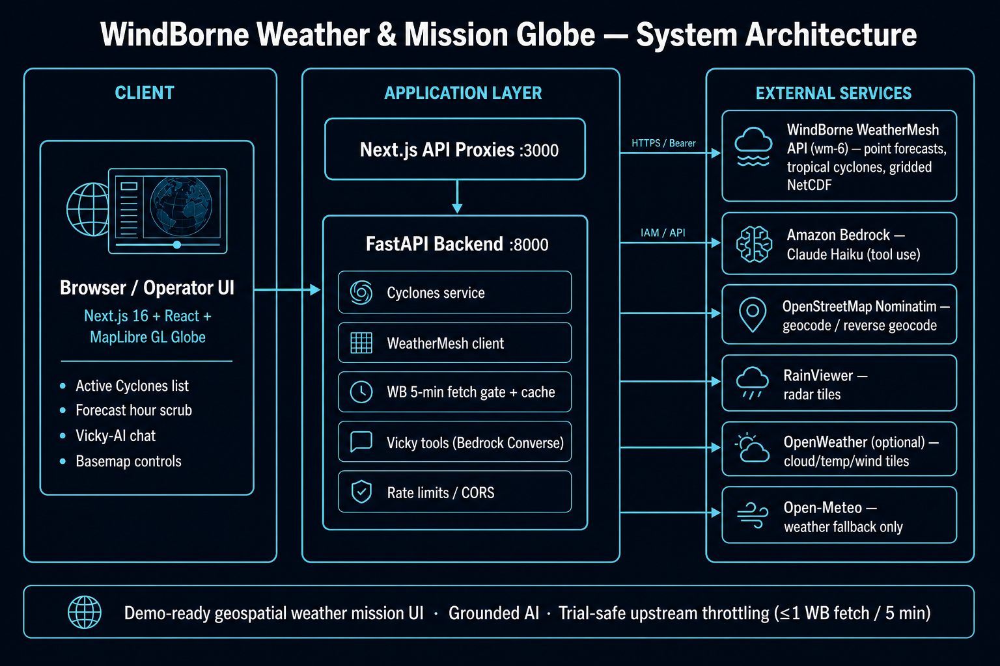
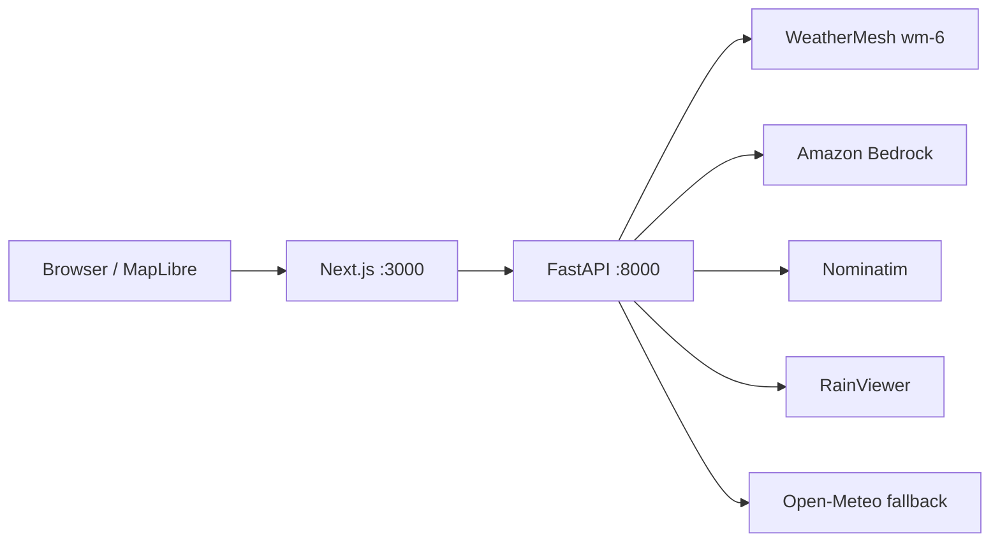

# WindBorne Weather & Mission Globe

Interactive **MapLibre 3D globe** for live **WindBorne WeatherMesh** forecasts, **tropical cyclone mission mode**, and **Vicky-AI** — an Amazon Bedrock co-pilot that answers only from grounded tools.

Built for operators and reviewers who need **real storm data when it exists**, and **honest gaps when WeatherMesh has not published a track yet**.

[](https://nextjs.org)
[](https://fastapi.tiangolo.com)
[](https://maplibre.org)
[](https://windbornesystems.com)
[](./AWS_BEDROCK_EC2_GUIDE.md)
[](https://www.python.org/)

---

## Architecture



| Layer | Responsibility |
|--------|----------------|
| **Client** | Next.js 16 + React + MapLibre globe, cyclone list/detail, forecast scrub, Vicky chat |
| **Edge proxies** | Next.js `/api/*` routes → FastAPI (no browser secrets for WeatherMesh / Bedrock) |
| **API** | FastAPI services: weather, tropical cyclones, gridded PNG/summary, chat tools, rate limits |
| **Upstream gate** | Shared WindBorne fetch gate (**default 300s**) + cache/stale so chat never blocks for minutes |
| **External** | WeatherMesh (`wm-6`), Bedrock Converse, Nominatim, RainViewer, optional OpenWeather |


```mermaid
flowchart LR
  UI[Browser / MapLibre] --> NX[Next.js :3000]
  NX --> API[FastAPI :8000]
  API --> WB[WeatherMesh wm-6]
  API --> BR[Amazon Bedrock]
  API --> NOM[Nominatim]
  API --> RV[RainViewer]
  API --> OM[Open-Meteo fallback]
```

---

## Features

| Capability | Details |
|------------|---------|
| **3D mission globe** | MapLibre globe, multiple basemaps (roads / hybrid / sat / terrain / dark) |
| **Tropical Cyclone Mode** | Active storm list, mean track, uncertainty cone, +0…+120h scrub, click → fly-to |
| **Sparse-storm honesty** | If WeatherMesh returns empty path (e.g. early systems), show **genesis** + clear “track not published” note — never invent routes |
| **WeatherMesh point forecast** | Temp, pressure, precip, wind; cached; Open-Meteo only as labeled fallback |
| **Gridded overlays** | Temp / wind / pressure / precip PNG for a capped bbox (`/api/weather/grid`) |
| **Vicky-AI** | Bedrock tool use: location, weather, `list_tropical_cyclones`, storm forecast, gridded summary |
| **Trial-safe WB usage** | Upstream spacing ≤ **1 fetch / 5 min** (`WB_MIN_REQUEST_INTERVAL_SEC=300`) |
| **Optional fleet UI** | Treasure balloons **off by default** (public feed not operationally accurate) |

**Out of scope (by design):** WindBorne does **not** provide avalanche alerts or news headlines. Region labels use reverse geocoding only.

---

## Quick start

**Prerequisites:** Node.js 18+, Python 3.10+, WindBorne API key. AWS credentials or EC2 IAM role for Vicky-AI.

### 1. Backend

```powershell
cd backend
python -m venv venv
.\venv\Scripts\Activate.ps1
pip install -r requirements.txt
copy .env.example .env
# Set WB_API_KEY=...
# Optional: AWS_REGION, BEDROCK_AGENT_MODEL
python -m uvicorn main:app --reload --host 127.0.0.1 --port 8000
```

### 2. Frontend

```powershell
# repo root
copy .env.example .env.local
npm install
npm run dev
```

Open [http://localhost:3000](http://localhost:3000).

### 3. Smoke checks

```powershell
curl http://127.0.0.1:8000/api/weather/mesh-status
curl "http://127.0.0.1:8000/api/cyclones?include_details=true"
```

---

## Environment

| Variable | Where | Purpose |
|----------|--------|---------|
| `WB_API_KEY` | `backend/.env` | WeatherMesh bearer token |
| `WINDBORNE_BASE_URL` | `backend/.env` | Default `https://api.windbornesystems.com` |
| `WEATHERMESH_MODEL` | `backend/.env` | Default `wm-6` |
| `WB_MIN_REQUEST_INTERVAL_SEC` | `backend/.env` | Min seconds between upstream WB fetches (**300**) |
| `WB_STALE_CACHE_TTL_SEC` | `backend/.env` | Serve last-good cyclone/grid data while gated (**1800**) |
| `CYCLONES_ENABLED` | `backend/.env` | Tropical cyclone APIs / AI tools |
| `GRIDDED_FORECASTS_ENABLED` | `backend/.env` | Gridded PNG / summary |
| `AWS_REGION` | `backend/.env` | Bedrock region |
| `BEDROCK_AGENT_MODEL` | `backend/.env` | Converse model / inference profile |
| `AWS_ACCESS_KEY_ID` / `SECRET` | `backend/.env` | Leave empty on EC2 with IAM role |
| `BALLOONS_ENABLED` | `backend/.env` | AI fleet tools (default **false**) |
| `ALLOWED_ORIGINS` | `backend/.env` | CORS allow-list (no `*`) |
| `CHAT_RPM_LIMIT` / `WEATHER_RPM_LIMIT` | `backend/.env` | Per-IP rate limits |
| `API_KEY` | `backend/.env` | Optional `X-API-Key` for chat |
| `OPENWEATHER_KEY` / `OPENWEATHER_RPM_LIMIT` | `backend/.env` | Optional tile proxy (default **50**/min) |
| `NEXT_PUBLIC_SHOW_BALLOONS` | `.env.local` | Show balloon markers globally |
| `FASTAPI_BACKEND_URL` | `.env.local` | Next proxy target (default `http://127.0.0.1:8000`) |

---

## API surface (FastAPI)

| Method | Path | Description |
|--------|------|-------------|
| `GET` | `/health` | Health |
| `GET` | `/api/weather?lat=&lon=` | Point forecast |
| `GET` | `/api/weather/mesh-status` | Cyclone/grid flags + WB gate status |
| `GET` | `/api/cyclones` | Storm list (`geojson=true` for MapLibre) |
| `GET` | `/api/cyclones/{id}` | Storm detail, route summary, region |
| `GET` | `/api/weather/grid` | Gridded `json` summary or `png` overlay |
| `GET` | `/api/chat/status` | Bedrock readiness |
| `POST` | `/api/chat` | Vicky-AI grounded chat |
| `GET` | `/api/openweather/tiles/...` | Rate-limited OWM tiles |
| `GET` | `/windborne` | Treasure telemetry (optional) |

More checks: [`API_CHECK.md`](./API_CHECK.md) · Bedrock on EC2: [`AWS_BEDROCK_EC2_GUIDE.md`](./AWS_BEDROCK_EC2_GUIDE.md)

---

## Project layout

```text
backend/
  main.py                 FastAPI routes + lifespan cyclone warm cache
  services/
    cyclones.py           Tropical cyclone normalize / GeoJSON
    gridded.py            NetCDF → PNG / summary
    wb_gate.py            5-min upstream gate + stale cache
    bedrock.py            Vicky Converse + tool routing
    ai_tools.py           Deterministic tools (weather, geocode, cyclones)
    windborne.py          Point forecast client
  tests/                  Pytest grounding + cyclone/gate tests
src/
  app/                    Next.js pages + /api proxies
  components/             Map, CycloneList/Detail, VickyChat, Layers
  services/               Frontend cyclone/weather clients
docs/
  architecture.png        System architecture diagram (HD)
```

---

## Design principles

1. **Grounded AI** — operational numbers come from tools; the model does not invent tracks or intensity.  
2. **Trial-safe upstream** — WeatherMesh fetches are gated and cached; chat returns stale/cached data instead of sleeping for minutes.  
3. **Honest sparse data** — empty cyclone paths surface as genesis + explicit “track not published” messaging.  
4. **Server-side secrets** — API keys stay on FastAPI; the browser talks to Next proxies.  
5. **Demo-ready, not hardened production** — RPM limits and CORS exist; auth is optional (`API_KEY`).

---

## Deploy (EC2 + PM2)

```bash
cd ~/Windborne-map   # or your clone path
git pull origin main
cd backend && source venv/bin/activate && pip install -r requirements.txt
cd .. && npm install && npm run build
pm2 restart windborne-api windborne-web
```

Confirm:

```bash
curl -s http://127.0.0.1:8000/api/weather/mesh-status | python3 -m json.tool
```

---

## Tests

```powershell
cd backend
.\venv\Scripts\Activate.ps1
python -m pytest tests/ -q
```

---

## License & attribution

- Weather and cyclone fields are from **WindBorne WeatherMesh** (official API).  
- Geocoding via **OpenStreetMap Nominatim** (respect usage policy).  
- Radar tiles via **RainViewer** where enabled.  
- This repository is a portfolio / demo integration — not an official WindBorne product.
