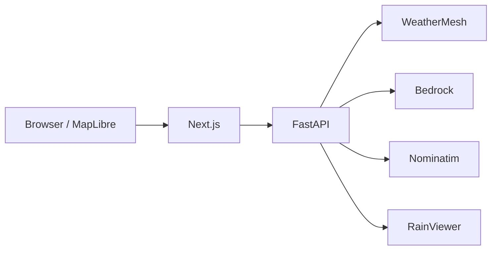

# WindBorne Weather & Mission Globe

Interactive **MapLibre** globe for live **WindBorne WeatherMesh** forecasts, **tropical cyclone mission mode**, and **Vicky-AI** — a grounded chat co-pilot that answers from verified tools, not invented numbers.

Built so operators see **real storm data when WeatherMesh publishes it**, and a clear gap when a track is not available yet.

[](https://nextjs.org)
[](https://fastapi.tiangolo.com)
[](https://maplibre.org)
[](https://windbornesystems.com)
[](https://www.python.org/)

---

## Architecture


| Layer | What it does |
|--------|----------------|
| **Browser** | Next.js UI + MapLibre globe, cyclone list/detail, forecast scrub, Vicky chat |
| **Next.js proxies** | `/api/*` → FastAPI so WeatherMesh / Bedrock secrets never reach the browser |
| **FastAPI** | Weather, cyclones, gridded overlays, forecast ranking, chat tools, rate limits |
| **Fetch gate** | Shared WindBorne gate (default **300s**) + cache/stale so chat does not block for minutes |


```mermaid
flowchart LR
  UI[Browser / MapLibre] --> NX[Next.js]
  NX --> API[FastAPI]
  API --> WB[WeatherMesh]
  API --> BR[Bedrock]
  API --> NOM[Nominatim]
  API --> RV[RainViewer]
```

---

## Services we use (and how)

| Service | Role in this project |
|---------|----------------------|
| **WindBorne WeatherMesh (`wm-6`)** | Source of truth for point forecasts, tropical cyclone tracks/cones, and gridded fields (NetCDF → PNG / ranking). All operational weather numbers come from here. |
| **Amazon Bedrock (Converse)** | Powers Vicky-AI chat. The model only explains tool results; it does not invent cyclone positions, winds, or ranked snowfall. |
| **OpenStreetMap Nominatim** | Forward geocode (place → lat/lon) and reverse geocode (coords → region label) for chat and ranked locations. |
| **MapLibre GL** | 3D globe, cyclone layers, gridded overlays, ranked markers, fly-to actions. |
| **RainViewer** | Optional radar tile overlay on the map. |
| **OpenWeather** | Optional cloud / temp / wind map tiles (rate-limited proxy). |
| **Open-Meteo** | Labeled fallback only when WeatherMesh point weather is unavailable. |

**Vicky tool routing (deterministic first):**

1. Cyclone forecast questions → `get_cyclone_forecast` (resolve name → path hour → lat/lon/wind/pressure)
2. Top-N snow / wind / precip / temp → `rank_forecast_locations` (named region or current map view; ranking in Python)
3. Active storm list / strongest cyclone → `list_tropical_cyclones`
4. Place names → Nominatim `search_location`
5. Everything else → Bedrock with the same tools, still grounded

---

## Features

| Capability | Details |
|------------|---------|
| **3D mission globe** | MapLibre globe, multiple basemaps |
| **Tropical Cyclone Mode** | Active list, mean track, cone, +0…+120h scrub, click → fly-to |
| **Sparse-storm honesty** | Empty path → genesis + “track not published” — never invent routes |
| **Cyclone forecast chat** | “Where is LALA in 24h?” → WeatherMesh path point + optional fly-to |
| **Regional ranking** | Top-N snowfall / precip / wind / temp for US, NA, Europe, Asia, or current map view |
| **WeatherMesh point forecast** | Temp, pressure, precip, wind; Open-Meteo only as labeled fallback |
| **Gridded overlays** | Temp / wind / pressure / precip PNG for a capped bbox |
| **Trial-safe WB usage** | ≤ **1 upstream fetch / 5 min** (`WB_MIN_REQUEST_INTERVAL_SEC=300`) |
| **Optional fleet UI** | Treasure balloons off by default |

**Out of scope:** Avalanche alerts and news headlines are not provided by WindBorne. Region labels use reverse geocoding only.

---

## Quick start

**Prerequisites:** Node.js 18+, Python 3.10+, WindBorne API key. Bedrock credentials (or local IAM) if you want Vicky-AI.

### 1. Backend

```powershell
cd backend
python -m venv venv
.\venv\Scripts\Activate.ps1
pip install -r requirements.txt
copy .env.example .env
# Set WB_API_KEY=...
# Optional for Vicky: AWS_REGION, BEDROCK_AGENT_MODEL (+ AWS credentials)
python -m uvicorn main:app --reload --host 127.0.0.1 --port 8000
```

### 2. Frontend

```powershell
# repo root
copy .env.example .env.local
npm install
npm run dev
```

Open [http://localhost:3000](http://localhost:3000).

### 3. Smoke checks

```powershell
curl http://127.0.0.1:8000/api/weather/mesh-status
curl "http://127.0.0.1:8000/api/cyclones?include_details=true"
```

---

## Environment

| Variable | Where | Purpose |
|----------|--------|---------|
| `WB_API_KEY` | `backend/.env` | WeatherMesh bearer token |
| `WINDBORNE_BASE_URL` | `backend/.env` | Default `https://api.windbornesystems.com` |
| `WEATHERMESH_MODEL` | `backend/.env` | Default `wm-6` |
| `WB_MIN_REQUEST_INTERVAL_SEC` | `backend/.env` | Min seconds between upstream WB fetches (**300**) |
| `WB_STALE_CACHE_TTL_SEC` | `backend/.env` | Serve last-good cyclone/grid data while gated (**1800**) |
| `CYCLONES_ENABLED` | `backend/.env` | Tropical cyclone APIs / AI tools |
| `GRIDDED_FORECASTS_ENABLED` | `backend/.env` | Gridded PNG / summary / ranking |
| `AWS_REGION` | `backend/.env` | Bedrock region (for Vicky-AI) |
| `BEDROCK_AGENT_MODEL` | `backend/.env` | Converse model / inference profile |
| `AWS_ACCESS_KEY_ID` / `SECRET` | `backend/.env` | Optional; omit if using default AWS credential chain |
| `BALLOONS_ENABLED` | `backend/.env` | AI fleet tools (default **false**) |
| `ALLOWED_ORIGINS` | `backend/.env` | CORS allow-list (no `*`) |
| `CHAT_RPM_LIMIT` / `WEATHER_RPM_LIMIT` | `backend/.env` | Per-IP rate limits |
| `API_KEY` | `backend/.env` | Optional `X-API-Key` for chat |
| `OPENWEATHER_KEY` / `OPENWEATHER_RPM_LIMIT` | `backend/.env` | Optional tile proxy |
| `NEXT_PUBLIC_SHOW_BALLOONS` | `.env.local` | Show balloon markers |
| `FASTAPI_BACKEND_URL` | `.env.local` | Next proxy target (default `http://127.0.0.1:8000`) |

---

## API surface (FastAPI)

| Method | Path | Description |
|--------|------|-------------|
| `GET` | `/health` | Health |
| `GET` | `/api/weather?lat=&lon=` | Point forecast |
| `GET` | `/api/weather/mesh-status` | Cyclone/grid flags + WB gate status |
| `GET` | `/api/cyclones` | Storm list (`geojson=true` for MapLibre) |
| `GET` | `/api/cyclones/{id}` | Storm detail, route summary, region |
| `GET` | `/api/weather/grid` | Gridded `json` summary or `png` overlay |
| `GET` | `/api/chat/status` | Bedrock readiness |
| `POST` | `/api/chat` | Vicky-AI grounded chat |
| `GET` | `/api/openweather/tiles/...` | Rate-limited OWM tiles |
| `GET` | `/windborne` | Treasure telemetry (optional) |

More checks: [`API_CHECK.md`](./API_CHECK.md)

---

## Project layout

```text
backend/
  main.py                 FastAPI routes + cyclone warm cache
  services/
    cyclones.py           Tropical cyclone normalize / GeoJSON / forecast position
    forecast_rank.py      Named-region / viewport top-N ranking
    gridded.py            NetCDF → PNG / summary / extrema
    wb_gate.py            5-min upstream gate + stale cache
    bedrock.py            Vicky Converse + deterministic routing
    ai_tools.py           Tools (weather, geocode, cyclones, rank)
    windborne.py          Point forecast client
  tests/                  Pytest grounding + routing tests
src/
  app/                    Next.js pages + /api proxies
  components/             Map, CycloneList/Detail, VickyChat, Layers
  services/               Frontend cyclone/weather clients
docs/
  architecture.png        System overview diagram
```

---

## Design principles

1. **Grounded AI** — operational numbers come from tools; the model does not invent tracks or intensity.  
2. **Trial-safe upstream** — WeatherMesh fetches are gated and cached; chat prefers stale/cached over long waits.  
3. **Honest sparse data** — empty cyclone paths surface as genesis + explicit “track not published”.  
4. **Server-side secrets** — API keys stay on FastAPI; the browser talks to Next proxies.  
5. **Demo-ready** — RPM limits and CORS exist; auth is optional (`API_KEY`).

---

## Tests

```powershell
cd backend
.\venv\Scripts\Activate.ps1
python -m pytest tests/ -q
```

---

## License & attribution

- Weather and cyclone fields are from **WindBorne WeatherMesh** (official API).  
- Geocoding via **OpenStreetMap Nominatim** (respect usage policy).  
- Radar tiles via **RainViewer** where enabled.  
- This repository is a portfolio / demo integration — not an official WindBorne product.
